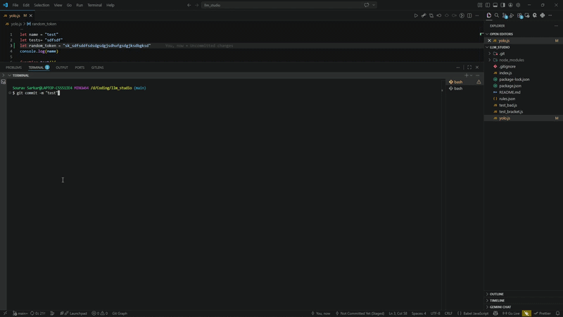
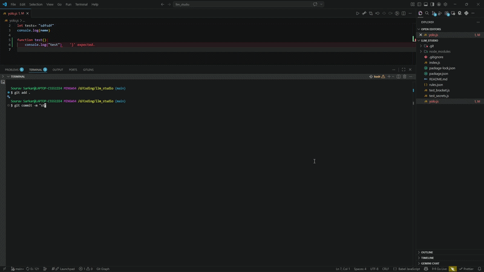
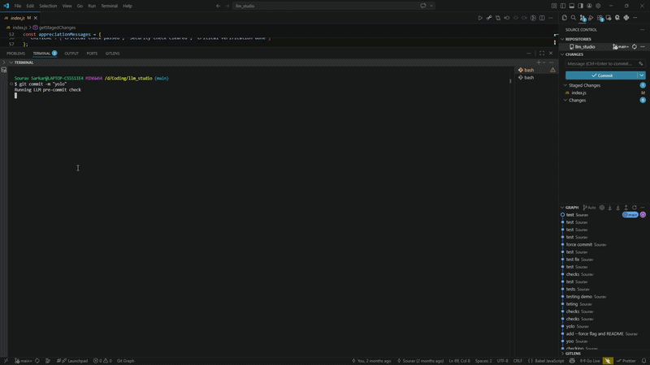
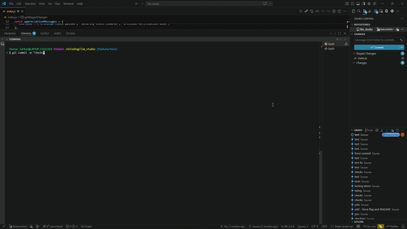

# Git Commit Security Validator

A pre-commit hook that uses a local LLM (Ollama) to analyze staged git changes and approve or block commits based on security rules.

## Tested Conditions

### Secret Detection
Blocks commits containing API keys, tokens, passwords, or other secrets.


### Code Quality Detection
Validates code syntax and quality before allowing commits.


### Branch Detection
Prevents direct commits to protected branches like main/master.


### Valid Commits
Allows commits when code passes all validation checks.


## Setup Instructions

### Prerequisites

1. **Install Node.js** (v14 or higher)
2. **Install Ollama** from https://ollama.ai
3. **Pull the LLM model**:
   ```bash
   ollama pull qwen2.5-coder:3b
   ```

### Installation

```bash
npm install
```

### Set Up as Git Pre-commit Hook

```bash
cp .git/hooks/pre-commit .git/hooks/pre-commit.bak 2>/dev/null || true
echo 'node index.js' > .git/hooks/pre-commit
chmod +x .git/hooks/pre-commit
```

### Usage

```bash
git add .
git commit -m "my changes"
```

To bypass validation:
```bash
git commit --no-verify -m "force commit"
```

## Configuration

Edit `rules.json` to customize security rules.

## Testing

Run the validation unit tests:
```bash
node test_samples/run_tests.cjs
```

The test suite includes:
- **Bracket validation tests** - Balanced brackets, braces, parentheses
- **Secret detection tests** - API keys, passwords, tokens
- **Excluded files tests** - Verifies index.js and rules.json are skipped
- **Multi-file tests** - Per-file bracket validation

### Sample Test Files

The `test_samples/` directory contains:
- `test_balanced_brackets.js` - ✅ Valid code with balanced brackets
- `test_unbalanced_braces.js` - ❌ Missing closing brace
- `test_unbalanced_parens.js` - ❌ Unbalanced parentheses
- `test_api_key.js` - ❌ Contains API key pattern
- `test_password.js` - ❌ Contains password

These can be staged and committed to manually test the pre-commit hook.
